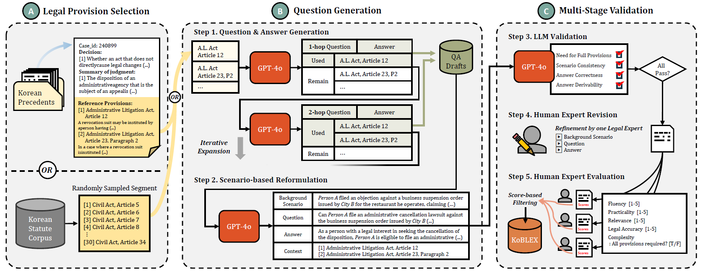

#  KoBLEX QA Draft Generator



This repository provides tools for automatically generating multi-hop legal question-answer (QA) pairs using OpenAI's GPT-4o.
It supports generation from either real-world legal case files or randomly selected statutory article collections.
Korean statutes and case files can be collected using the [Korean Law Information Service API](https://open.law.go.kr/LSO/main.do).

KoBLEX was constructed using these scripts, where all generated QA pairs are initially created as drafts and subsequently reviewed and refined by legal experts to ensure accuracy and reliability.


---

## Project Structure
```plaintext
├── sample/                    # Sample data files
│   ├── legal_cases_291.json   # Sample legal case file (291 cases)
│   └── statute_sample.jsonl   # Sample statute collection file (266 statutes)
├── prompts/
│   ├── full_check.txt         # Prompt template for full check (step 2)
│   ├── partial_check.txt      # Prompt template for partial check (step 2)
│   ├── qg_pair_1hop.txt       # Prompt template for 1-hop QA generation (step 1)
│   ├── qg_pair_mhop.txt       # Prompt template for multi-hop QA generation (step 1)
│   └── qg_scenario.txt        # Prompt template for background scenario generation (step 1)
├── qg_utils.py                # Utility functions (e.g., formatting statutes)
├── qg_1step.py                # Script for generating QA pairs (step 1)
├── qg_2step.py                # Script for validating QA pairs (step 2)
├── qg_result/                 # Folder to store generated QA data
└── README.md                  
```

## How to Run

### 1. Case-Based QA Generation

```bash
python qg_1step.py \
  --llm gpt-4o \
  --case_path sample/legal_cases_291.json \ # sample legal case file
  --num_qa_pairs 3 \  # Number of documents to process
  --qg_type case
```

OR

### 1. Random Statute-Based QA Generation

```bash
python qg_1step.py \
  --llm gpt-4o \
  --collection_path sample/statute_sample.jsonl \ # sample statute collection file  
  --num_qa_pairs 3 \  # Number of documents to process
  --qg_type random
```

* By default, the output is saved to: `qg_result/{filename}_qg_draft.json`
* You can override the save path with `--save_path`

---

### 2. QA Validation 

To check the validity of generated QA pairs (partial and full consistency):

```bash
python qg_2step.py \
  --llm gpt-4o \
  --qg_path qg_result/{SAMPLE_QG_DRAFT}.json  # Path to the generated QA draft file
```

* The output will be saved to: `qg_result/{filename}_qg_validated.json`
* We used only the data samples that passed **both** `partial_total_check` and `full_total_check` validations from `qg_2step.py` for constructing the final **KoBLEX** dataset.